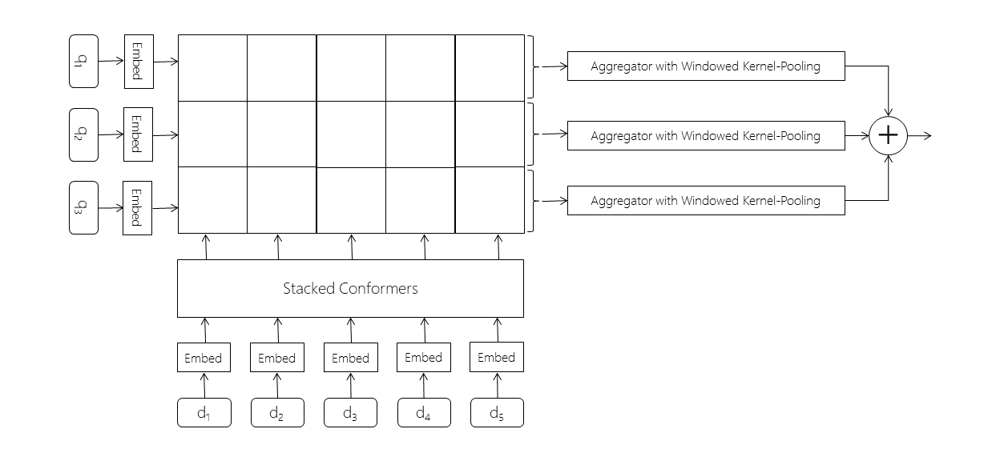

# TREC Deep Learning Quick Start

This is a quick start guide for the document ranking task in the TREC Deep Learning (TREC-DL) benchmark.
If you are new to TREC-DL, then this repository may make it more convenient for you to download all the required datasets and then train and evaluate a relatively efficient deep neural baseline on this benchmark, under both the rerank and the fullrank settings.

If you are unfamiliar with the TREC-DL benchmark, then you may want to first go through the websites and overview paper corresponding to previous and current editions of the track.
* TREC-DL 2019: [website](https://microsoft.github.io/TREC-2019-Deep-Learning) and [overview paper](https://arxiv.org/pdf/2003.07820.pdf)
* TREC-DL 2020: [website](https://microsoft.github.io/TREC-2020-Deep-Learning/) (Currently open for submissions!)

### DISCLAIMER
While I and some of the other contributors to this repository are also serving as organizers for TREC-DL, please note that this is **NOT** in any way officially associated with the TREC track.
Instead, this is a personal codebase that I have been using for my own experimentation and am releasing it publicly with the hope that it may be useful for others who are just starting out on this benchmark.

As with any research code, you may find some kinks or bugs.
Please report any and all bugs and issues you discover, and I will try to get to them as soon as possible.
If you have any questions or feedback, please reach out to me via [email](mailto:bmitra@microsoft.com) or [Twitter](https://twitter.com/UnderdogGeek).

Also, please be aware that I may sometimes push new changes and model updates based on personal on-going research and experimentation.


## The Conformer-Kernel Model with Query Term Independence (QTI)

The base model implements the Conformer-Kernel architecture with QTI, as described in this [paper]().



If you use this code for your research, please cite the [paper]() as follows:

```
@article{mitra2020conformer,
    title={Conformer-Kernel with Query Term Independence for Document Retrieval},
    author={Mitra, Bhaskar and Hofstatter, Sebastian and Zamani, Hamed and Craswell, Nick},
    journal={arXiv preprint arXiv:},
    year={2020}
}
```

Specifically, the code provides a choice between three existing models:
* **NDRM1**: A Conformer-Kernel architecture with QTI for latent representation learning and matching
* **NDRM2**: A simple learned BM25-like ranking function with QTI for explicit term matching
* **NDRM3** (default): A linear combination of **NDRM1** and **NDRM2**


## Requirements

## Getting Started

Please clone the repo and run ```python run.py```.
The script should download all necessary data files, if missing, which can take significant amount of time depending on network speed.
So, please be patient and if the download fails for any particular file then please delete the local incomplete copy of the file and re-run the script.
After the download completes, the script should train a simple neural document ranking model (NDRM) and report metrics on the TREC 2019 test set for the document reranking task.


## Legal Notices

Microsoft and any contributors grant you a license to the Microsoft documentation and other content in this repository under the [Creative Commons Attribution 4.0 International Public License](https://creativecommons.org/licenses/by/4.0/legalcode), see the [LICENSE](LICENSE) file, and grant you a license to any code in the repository under the [MIT License](https://opensource.org/licenses/MIT), see the [LICENSE-CODE](LICENSE-CODE) file.

Microsoft, Windows, Microsoft Azure and/or other Microsoft products and services referenced in the documentation
may be either trademarks or registered trademarks of Microsoft in the United States and/or other countries.
The licenses for this project do not grant you rights to use any Microsoft names, logos, or trademarks.
Microsoft's general trademark guidelines can be found at <http://go.microsoft.com/fwlink/?LinkID=254653>.

Privacy information can be found at <https://privacy.microsoft.com/en-us/>.

Microsoft and any contributors reserve all other rights, whether under their respective copyrights, patents,
or trademarks, whether by implication, estoppel or otherwise.
